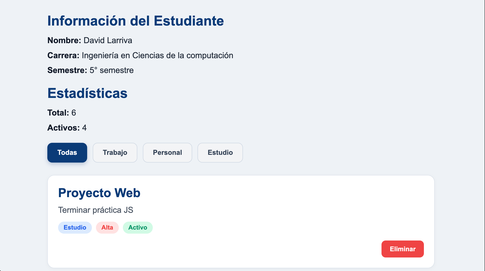
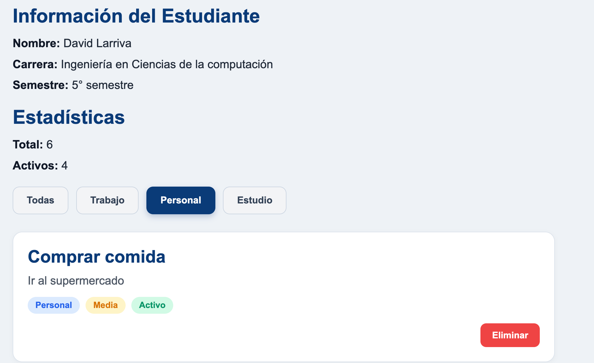

# Práctica 2: Manipulación Básica del DOM

**Autor:** David Alejandro Larriva Castillo  
**Universidad:** Universidad Politécnica Salesiana 


## Descripción de la solución
En esta práctica se implementó una aplicación web interactiva que genera su interfaz completamente a través de la manipulación del DOM con JavaScript. La aplicación permite visualizar una lista de tareas  , filtrarlas dinámicamente mediante botones, y eliminar elementos específicos. Además, cuenta con un panel de estadísticas que se actualiza según los elementos renderizados y la información estática del estudiante.

## Fragmentos de Código Destacado

### 1. Renderizado dinámico con `createDocumentFragment`
Se utilizó un fragmento de documento para optimizar la inserción de múltiples elementos en el DOM, mejorando el rendimiento de la aplicación.
```javascript
function renderizarLista(datos) {
  const contenedor = document.getElementById('contenedor-lista');
  contenedor.innerHTML = '';
  const fragment = document.createDocumentFragment();

  datos.forEach(el => {
    // Creación dinámica de elementos (div, h3, p, span, button)
    const card = document.createElement('div');
    card.classList.add('card');
    // ... ensamblaje de la tarjeta ...
    fragment.appendChild(card);
  });

  contenedor.appendChild(fragment);
  actualizarEstadisticas();
}
```

### 2. Lógica de Filtrado por Categorías
El filtrado interactúa directamente con los datos de los elementos y vuelve a renderizar la lista completa usando `filter()`.
```javascript
function inicializarFiltros() {
  const botones = document.querySelectorAll('.btn-filtro');
  botones.forEach(btn => {
    btn.addEventListener('click', () => {
      const categoria = btn.dataset.categoria;
      
      // Manejo de clases activas para la interfaz
      document.querySelectorAll('.btn-filtro').forEach(b => b.classList.remove('btn-filtro-activo'));
      btn.classList.add('btn-filtro-activo');

      // Filtrado del array original
      if (categoria === 'todas') {
        renderizarLista(elementos);
      } else {
        const filtrados = elementos.filter(e => e.categoria === categoria);
        renderizarLista(filtrados);
      }
    });
  });
}
```

### 3. Eliminación de Elementos
Elimina un nodo especifico basándose en el identificador único del elemento y actualiza el DOM inmediatamente.
```javascript
function eliminarElemento(id) {
  const index = elementos.findIndex(el => el.id === id);
  if (index !== -1) {
    elementos.splice(index, 1);
    renderizarLista(elementos);
  }
}
```

---

## Capturas de Ejecución

A continuación se evidencia el funcionamiento de la aplicación:

### 1. Vista General Inicial

*La vista inicial carga la información del estudiante, las estadísticas globales y renderiza la lista completa de elementos base.*

### 2. Filtrado de Categorías

*Al aplicar un filtro, la lista se reduce dinámicamente sin recargar la página, mostrando únicamente los elementos de la categoría seleccionada.*