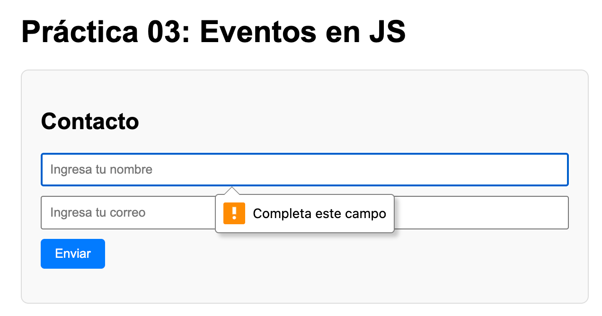
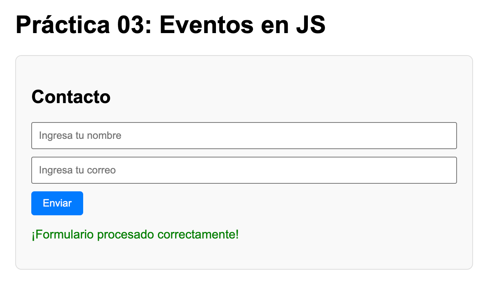
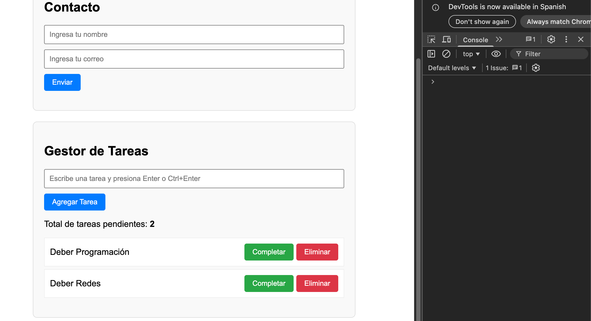
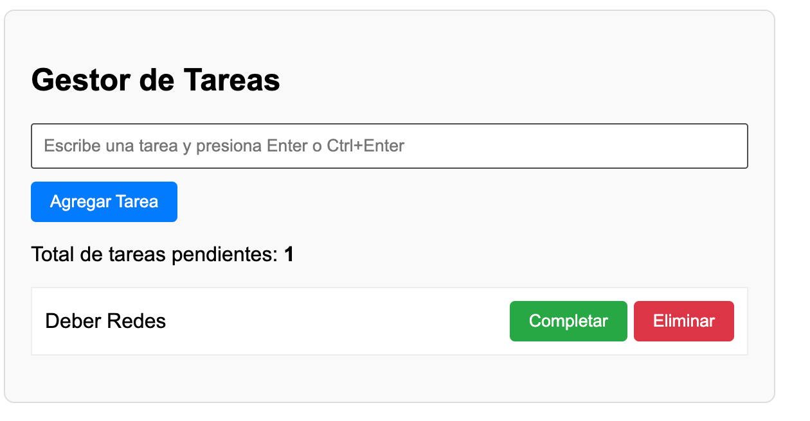
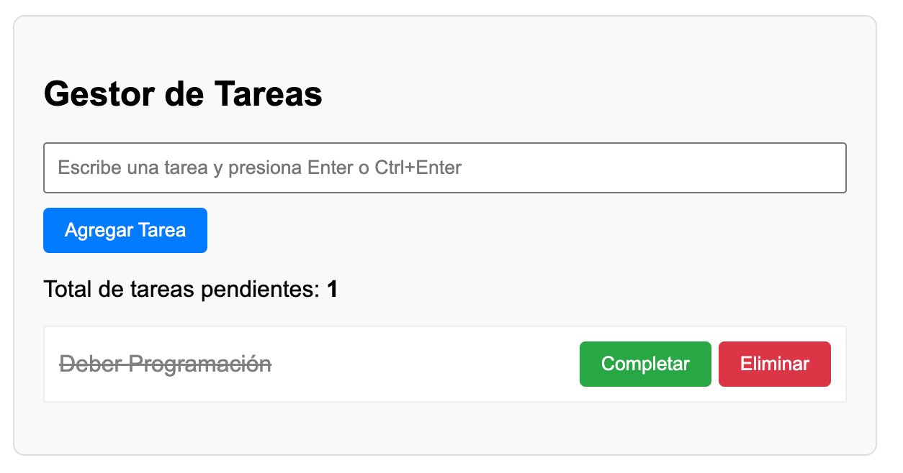

# Práctica 03: Eventos en JavaScript
**Autor:** David Alejandro Larriva Castillo  
**Universidad:** Universidad Politécnica Salesiana 
## Descripción de la solución
El objetivo principal de esta práctica fue aplicar eventos interactivos mediante JavaScript. Para lograrlo, desarrollé un formulario de contacto que valida la información del usuario y utiliza preventDefault() para evitar que la página se recargue de forma innecesaria. Además, programé un gestor de tareas que aprovecha la Delegación de Eventos para controlar los botones que se generan de manera dinámica en el DOM. Finalmente, para mejorar la experiencia de usuario, implementé atajos de teclado como Ctrl + Enter al momento de ingresar nuevas tareas.

## Fragmentos de Código Destacado

### 1. Validación de formulario con preventDefault()
```javascript
formulario.addEventListener('submit', function(e) {
    e.preventDefault(); // Evita la recarga automática de la página

    const nombre = document.getElementById('nombre').value;
    const email = document.getElementById('email').value;
    
    // Lógica de validación y mensajes de retroalimentación...
});
```

### 2. Event delegation en la lista de tareas
```javascript
listaTareas.addEventListener('click', function(e) {
    // Escucha los clics en el contenedor <ul> y delega la acción según el botón
    if (e.target.classList.contains('btn-eliminar')) {
        e.target.parentElement.remove();
        totalTareas--;
        actualizarContador();
    } else if (e.target.classList.contains('btn-completar')) {
        const spanTexto = e.target.parentElement.querySelector('.texto-tarea');
        spanTexto.classList.add('completada');
    }
});
```

### 3. Atajo de teclado con Ctrl+Enter
```javascript
inputTarea.addEventListener('keydown', function(e) {
    // Detecta si se presiona Enter por sí solo o acompañado de la tecla Ctrl
    if (e.key === 'Enter' || (e.ctrlKey && e.key === 'Enter')) {
        agregarNuevaTarea();
    }
});
```

---

## Capturas de Ejecución

A continuación, se presentan las capturas funcionamiento de los eventos requeridos en la práctica:

### 1. Validación en acción


### 2. Formulario procesado


### 3. Event delegation funcionando


### 4. Contador de tareas actualizado


### 5. Tareas completadas
