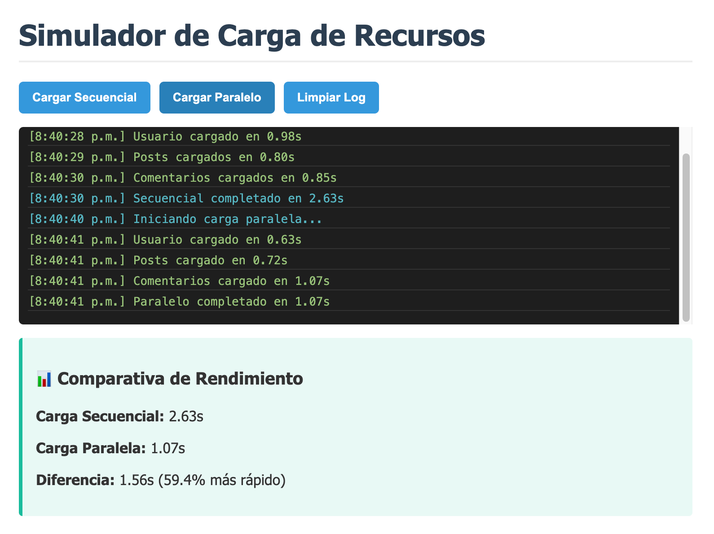
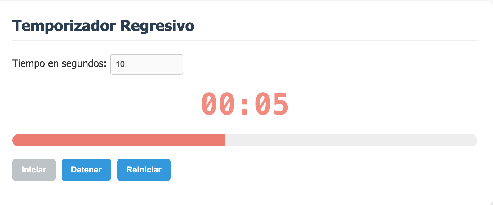
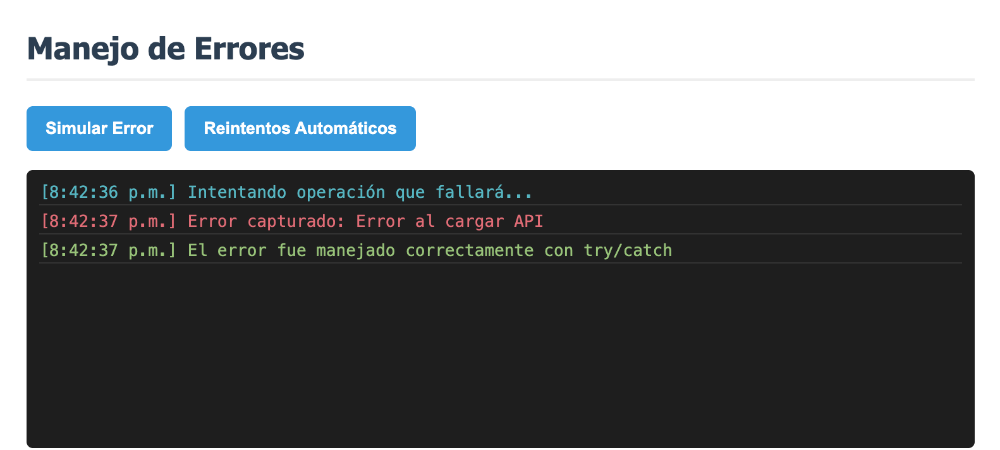

# Práctica 5: Programación Asíncrona

**Autor:** David Alejandro Larriva Castillo  
**Universidad:** Universidad Politécnica Salesiana 

## Descripción del Simulador
En esta práctica se implementó un simulador interactivo para comprender el funcionamiento de la asincronía en JavaScript. La aplicación consta de tres módulos:
1. **Simulador de Cargas:** Permite visualizar y comparar la drástica diferencia de tiempo y rendimiento entre resolver promesas de forma secuencial (`await` consecutivos) versus de forma paralela (`Promise.all`).
2. **Temporizador Regresivo:** Utiliza `setInterval` para actualizar el DOM en tiempo real, con cálculos de porcentaje para una barra de progreso interactiva.
3. **Manejo de Errores:** Implementa bloques `try/catch` para capturar rechazos de promesas y simula un patrón de reintentos automáticos utilizando "backoff exponencial".

---

## Fragmentos de Código Destacado

### 1. Función que retorna promesa con `setTimeout`
```javascript
function simularPeticion(nombre, tiempoMin = 500, tiempoMax = 2000, fallar = false) {
    return new Promise((resolve, reject) => {
        const tiempoDelay = Math.floor(Math.random() * (tiempoMax - tiempoMin + 1)) + tiempoMin;
        setTimeout(() => {
            if (fallar) reject(new Error(`Error al cargar ${nombre}`));
            else resolve({ nombre, tiempo: tiempoDelay });
        }, tiempoDelay);
    });
}
```

### 2. Carga Paralela con `Promise.all`
```javascript
async function cargarParalelo() {
    try {
        const promesas = [
            simularPeticion('Usuario', 500, 1000),
            simularPeticion('Posts', 700, 1500),
            simularPeticion('Comentarios', 600, 1200)
        ];
        // Ejecuta todas las peticiones al mismo tiempo
        const resultadosPromesas = await Promise.all(promesas); 
    } catch (error) {
        mostrarLog(`Error: ${error.message}`, 'error');
    }
}
```

### 3. Reintentos Automáticos y `try/catch`
```javascript
for (let i = 0; i < intentos; i++) {
    try {
        const resultado = await simularPeticion(nombre, 500, 1000, Math.random() > 0.5);
        return resultado; // Si funciona, sale del loop
    } catch (error) {
        if (i === intentos - 1) throw new Error(`Falló tras ${intentos} intentos`);
        const espera = Math.pow(2, i) * 500; // Backoff exponencial
        await new Promise(resolve => setTimeout(resolve, espera));
    }
}
```

---

## Análisis de Rendimiento (Secuencial vs Paralela)
Durante las pruebas del simulador, se observó que la **carga secuencial** suma el tiempo de espera de cada petición (ej. 800ms + 1200ms + 900ms ≈ 2.9s), ya que el hilo de ejecución se pausa esperando cada respuesta. Por el contrario, la **carga paralela** envía todas las peticiones al mismo tiempo, resultando en que el tiempo total de espera equivale únicamente al de la petición más lenta (ej. 1200ms). Esto representa, en promedio, una **mejora de velocidad superior al 50%**.

---

## Capturas de Ejecución

### 1. Comparativa secuencial vs paralelo

**Descripción:** La carga secuencial sumó los delays individuales, mientras que la paralela redujo drásticamente el tiempo de espera.

### 2. Temporizador en acción

**Descripción:** Temporizador corriendo, actualizando la barra de progreso y entrando en estado de alerta visual (rojo) en los últimos 10 segundos.

### 3. Manejo de errores

**Descripción:** Captura de un error controlado mediante `try/catch` sin que la aplicación se congele.