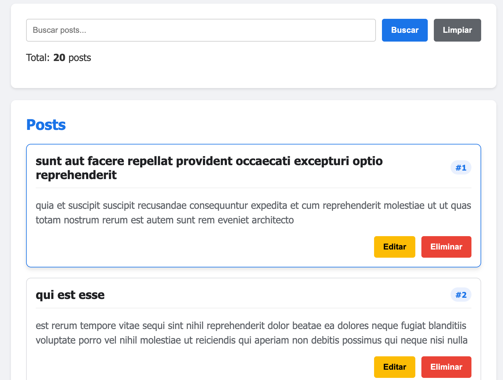
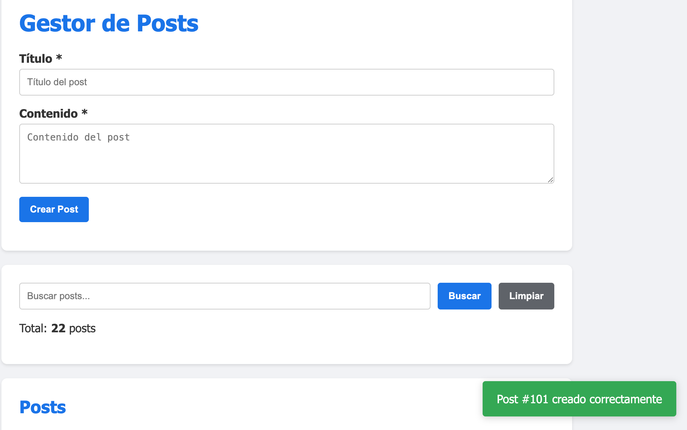
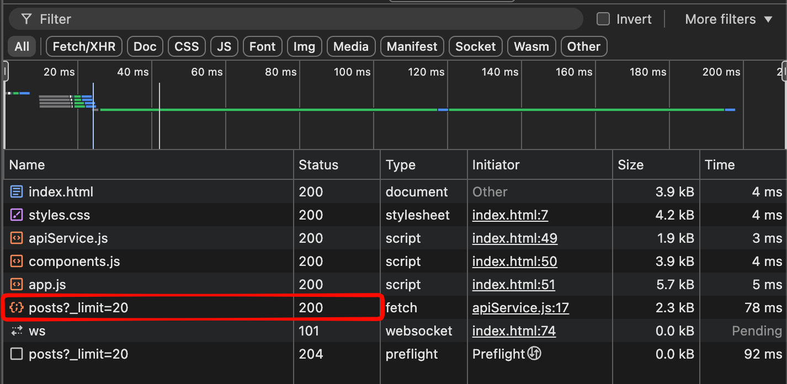
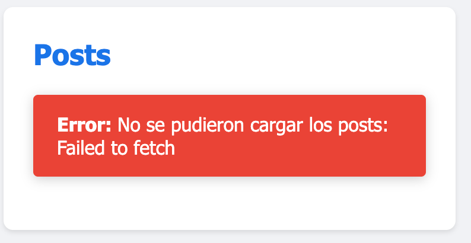

# Práctica 6: Fetch API y Consumo de Servicios

**Autor:** David Alejandro Larriva Castillo  
**Universidad:** Universidad Politécnica Salesiana 

## Descripción de la solución
En esta práctica se desarrolló una aplicación web que interactúa con una API REST externa (JSONPlaceholder) mediante `Fetch API`. Se implementó un flujo completo de operaciones CRUD. Para garantizar la seguridad (evitando vulnerabilidades XSS) y el rendimiento, toda la renderización dinámica de los datos se construyó utilizando estrictamente la API del DOM (`createElement`, `appendChild`, `textContent`), separando la lógica en un servicio de red (`apiService.js`) y módulos de interfaz (`components.js`).

## Fragmentos de Código Destacado

### 1. Petición GET con Fetch y manejo de errores (apiService.js)
Se encapsuló la lógica de fetch en un método base que evalúa `response.ok` antes de parsear los datos, ya que Fetch no lanza excepciones automáticamente para errores HTTP 4xx o 5xx.
```javascript
async request(endpoint, options = {}) {
    const url = `${this.baseUrl}${endpoint}`;
    // ... configuracion
    try {
        const response = await fetch(url, config);
        if (!response.ok) {
            throw new Error(`HTTP Error: ${response.status}`);
        }
        return response.status === 204 ? null : await response.json();
    } catch (error) {
        throw error;
    }
}
```

### 2. Creación segura de elementos del DOM (components.js)
Se evitó el uso de `innerHTML` para datos dinámicos. En su lugar, se construyeron los nodos paso a paso para prevenir inyección de código.
```javascript
function PostCard(post) {
    const article = document.createElement('article');
    article.className = 'post-card fade-in';
    
    const title = document.createElement('h3');
    title.textContent = post.title; // SEGURO: textContent no interpreta HTML
    
    // ... ensamblaje
    article.appendChild(title);
    return article;
}
```

### 3. Ejecución de POST y actualización de estado (app.js)
Se envían los datos convertidos a cadena JSON y, tras la confirmación de la API, se actualiza el array local de estado y la interfaz sin necesidad de recargar la página.
```javascript
resultado = await ApiService.createPost(datosPost);
posts.unshift(resultado); // Agrega al inicio del array local
mostrarMensajeTemporal(mensajeEstado, MensajeExito(`Post #${resultado.id} creado`), 3000);
renderizarPosts(postsFiltrados, listaPosts);
```

---

## Disable caché
* **Pestaña Network:** Al principio, no lograba capturar la petición con el `Status 200 OK` en la consola. A veces no aparecía nada y otras veces recibía un `304 Not Modified`. Entendí que la pestaña Network solo registra la actividad que ocurre *después* de abrirla, y que el navegador suele usar datos en caché para acelerar la carga. Para solucionarlo y ver las peticiones reales, aprendí a mantener abiertas las DevTools, marcar la opción **"Disable cache"** y luego recargar la página.


---

## Capturas de Ejecución y Evidencias

### 1. Datos cargados desde la API

*Se obtienen los registros iniciales mediante el método GET y se renderizan dinámicamente en el DOM.*

### 2. Creación de un recurso (POST)

*Al enviar el formulario, el nuevo recurso se procesa y se renderiza instantáneamente en la parte superior, actualizando el contador y lanzando un badge de éxito.*

### 3. Pestaña Network (DevTools)

*Evidencia de la petición asíncrona hacia la API REST visualizada en las herramientas de desarrollo del navegador, mostrando el Status Code 200 OK.*

### 4. Manejo de Errores Visual

*Si la petición falla (por ejemplo, error de red), el sistema lo captura mediante el bloque `catch` y lo muestra sin romper la aplicación.*