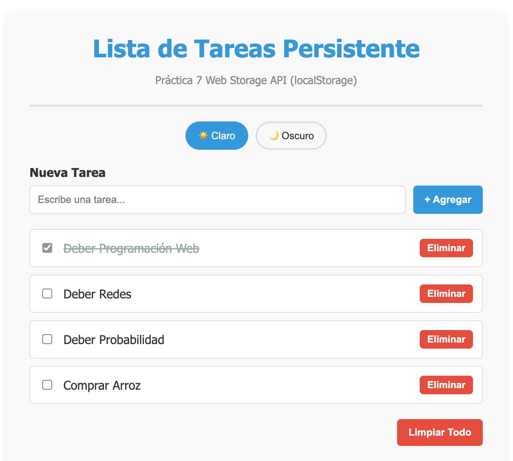
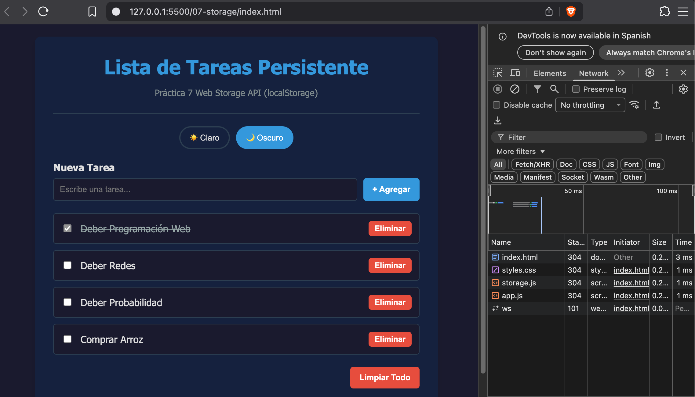
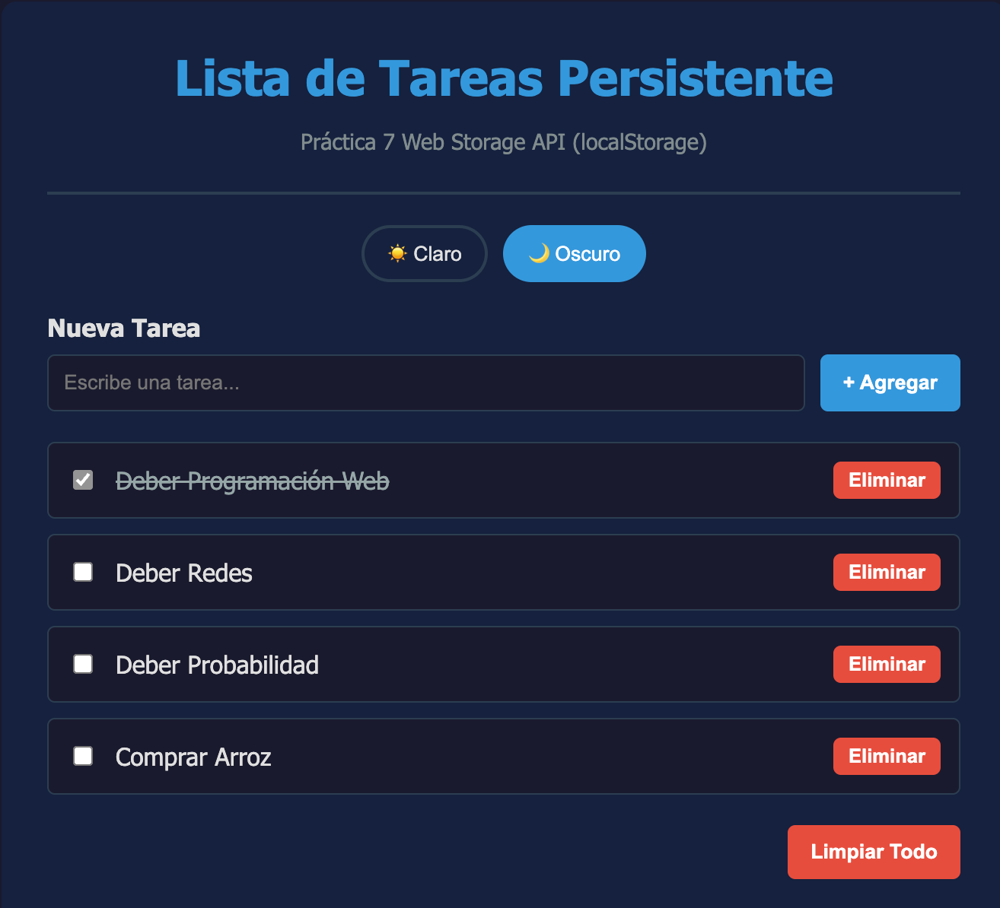
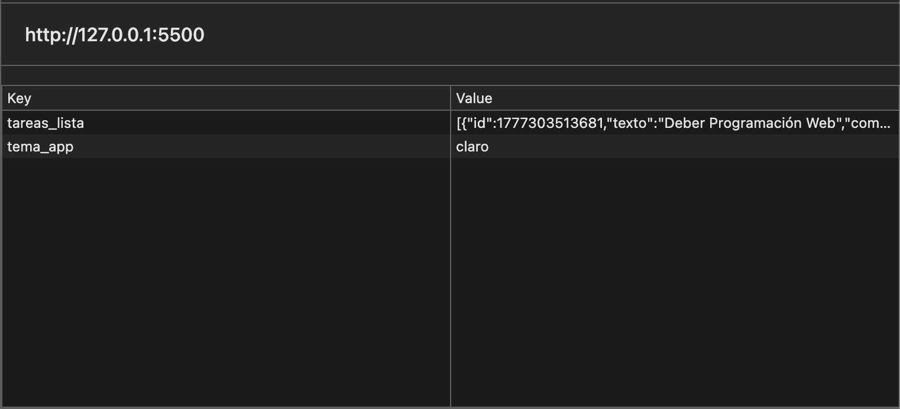

# Práctica 7: Web Storage y Persistencia

**Autor:** David Alejandro Larriva Castillo  
**Universidad:** Universidad Politécnica Salesiana 

## Descripción
En esta práctica se desarrolló una aplicación de gestión de tareas "To-Do List" enfocada en la persistencia de datos utilizando la API de `Web Storage` (específicamente `localStorage`). Se implementó un patrón de arquitectura basado en *Servicios* para aislar y centralizar la lógica de lectura/escritura (conversión de JSON a Strings y viceversa), separándola de la manipulación del DOM. Además de mantener los datos de los ítems a través de recargas de página, el sistema también guarda y recupera las preferencias visuales del usuario (Selector de Tema Claro/Oscuro).

## Fragmentos de Código

### 1. Servicio Centralizado para el Storage (storage.js)
Se creó un wrapper que maneja los métodos de `localStorage`, encapsulando la serialización de objetos y el manejo de excepciones para evitar cuelgues si el storage está lleno o bloqueado.
```javascript
const TareaStorage = {
    CLAVE: 'tareas_lista',
    getAll() {
        try {
            const datos = localStorage.getItem(this.CLAVE);
            return datos ? JSON.parse(datos) : [];
        } catch (error) {
            console.error('Error al leer tareas:', error);
            return [];
        }
    },
    // ... métodos de escritura y actualización
};
```

### 2. Prevención de Inyecciones XSS (app.js)
Se prohibió estrictamente el uso de `innerHTML` para renderizar contenido proporcionado por el usuario. En su lugar, se utilizó la API del DOM (`createElement` y `textContent`) asegurando que los inputs se inserten como nodos de texto puro.
```javascript
function crearElementoTarea(tarea) {
    const li = document.createElement('li');
    // ... ensamblaje de la card
    const span = document.createElement('span');
    span.textContent = tarea.texto; // SEGURO: Escapa caracteres HTML automáticamente
    
    li.appendChild(span);
    return li;
}
```

### 3. Persistencia de Tema Dinámico
Se utilizan variables CSS (`--bg-primary`, `--text-color`, etc.) gestionadas desde JavaScript. Al cambiar el tema, este se guarda en el `localStorage` y se recupera instantáneamente en la fase de inicialización.
```javascript
function aplicarTema(nombreTema) {
    if (nombreTema === 'oscuro') {
        document.documentElement.style.setProperty('--bg-primary', '#1a1a2e');
        // ... otras variables oscuras
    } else {
        // ... variables claras
    }
    TemaStorage.setTema(nombreTema); // Guarda la preferencia del usuario
}
```

---

## Capturas de Ejecución y Evidencias

### 1. Lista con datos persistentes

*Se crearon diversas tareas y se interactuó con sus estados.*

### 2. Persistencia comprobada

*Al forzar la recarga de la pestaña del navegador, el estado de las tareas y los checkboxes se mantiene exactamente igual gracias a la lectura inicial desde el `localStorage`.*

### 3. Cambio y persistencia de Tema 

*La preferencia de interfaz del usuario se almacena independientemente de la data de las tareas, recuperándose al instante de la carga.*

### 4. DevTools Application > Local Storage

*Evidencia técnica en el navegador donde se aprecian las claves (`tareas_lista` y `tema_app`) con sus respectivos *Values* almacenados como Strings JSON.*