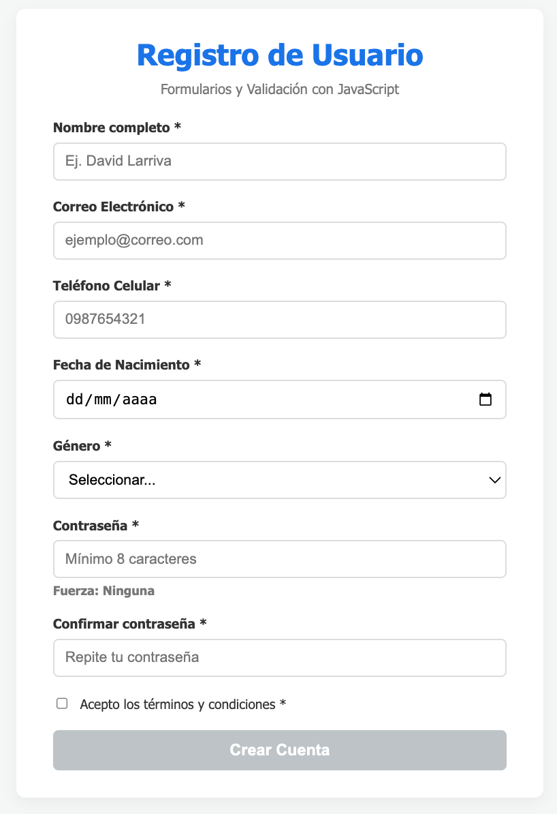
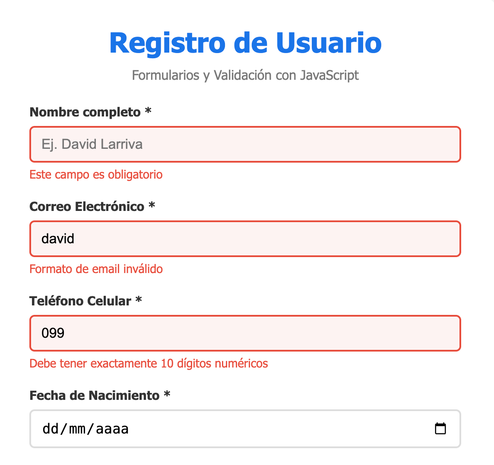
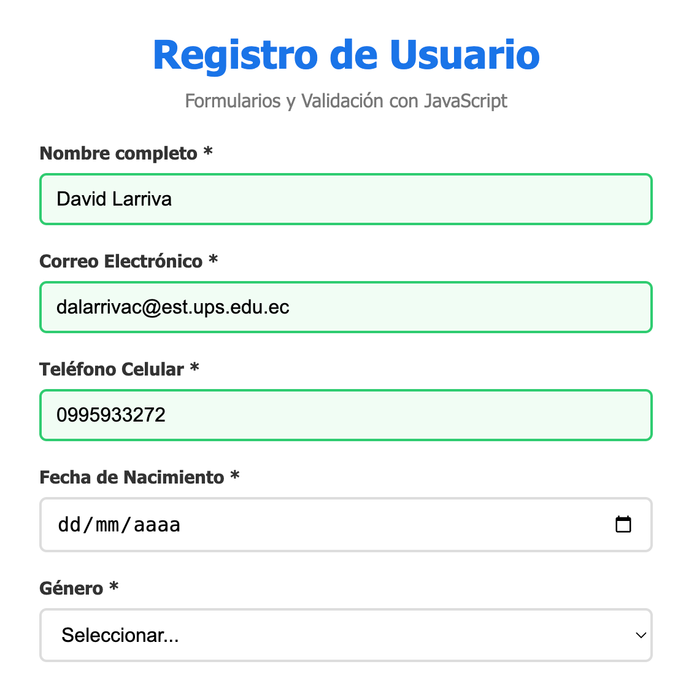
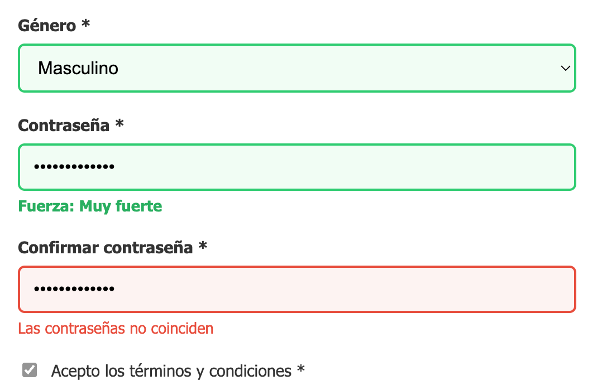
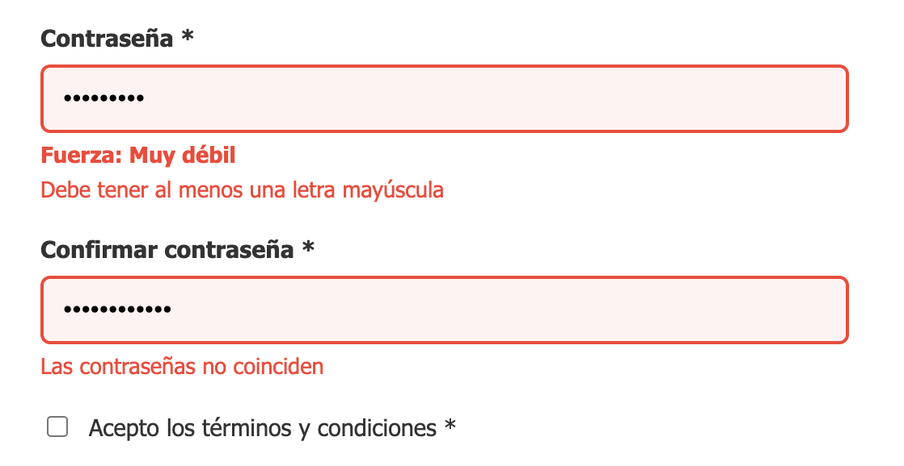
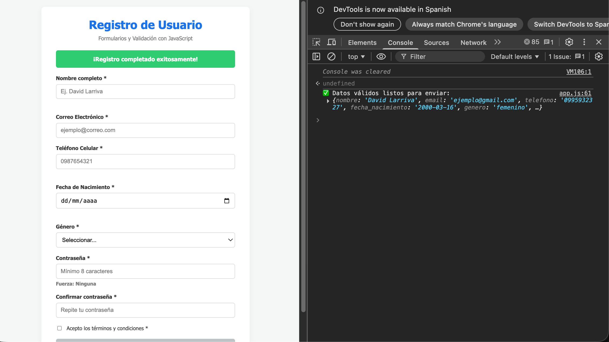
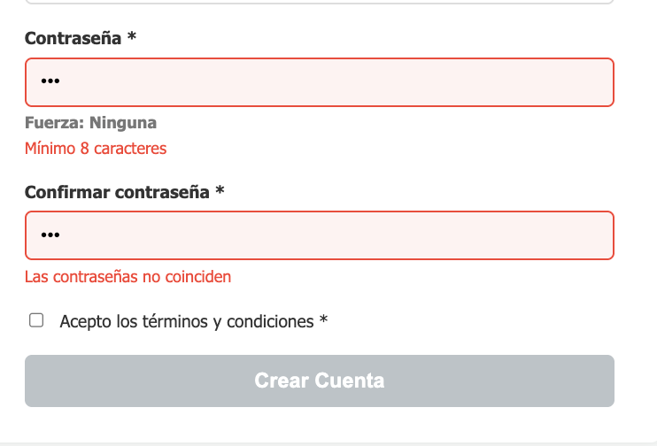
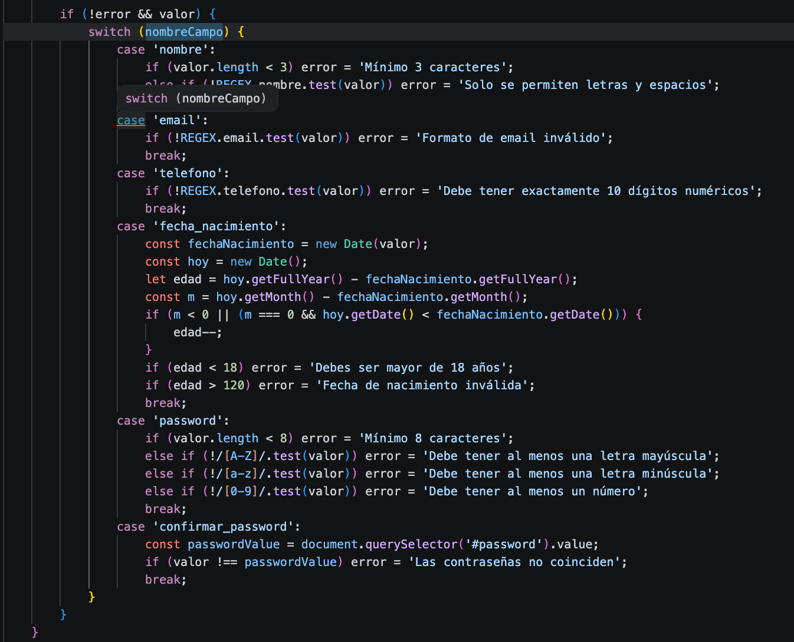

# Práctica 8: Formularios y Validación

**Autor:** David Alejandro Larriva Castillo  
**Universidad:** Universidad Politécnica Salesiana 

## Descripción de la solución
En esta práctica se construyó un formulario de registro interactivo delegando toda la responsabilidad de la validación a JavaScript mediante la desactivación de la validación nativa del navegador (usando `novalidate`). La interfaz reacciona en tiempo real proporcionando feedback visual explícito: bordes verdes para inputs correctos y bordes rojos con alertas DOM para los incorrectos. Además de aplicar la API `FormData`, se incluyeron características como medidor de fuerza de contraseñas y, cumpliendo con el requerimiento de una funcionalidad extra, el bloqueo dinámico del botón de envío.

## Retos y Aprendizajes durante el Desarrollo
* **Manejo de estados con Checkboxes en FormData:** Comprendí que la API `FormData` ignora por defecto los `checkboxes` que no están marcados. Para integrarlo correctamente al flujo de validación y extracción de datos, tuve que seleccionarlo manualmente vía DOM e incrustar su propiedad booleana `checked` en el objeto final procesado por `Object.fromEntries()`.
* **Eventos `input` vs `focusout`:** Fue un reto interesante equilibrar la "agresividad" de la validación. Aprendí que usar `focusout` es ideal para mostrar errores al usuario solo cuando ha terminado de interactuar con el campo, mientras que el evento `input` es perfecto para limpiar esos errores de forma inmediata y mejorar la experiencia mientras teclea. 

## Fragmentos de Código Destacado

### 1. Validación individual en tiempo real
La función central detecta el atributo `name` y aplica lógica personalizada (incluyendo expresiones regulares complejas para contraseñas) y devuelve un feedback seguro mediante la creación de nodos en el DOM, sin usar `innerHTML`.
```javascript
case 'password':
    if (valor.length < 8) error = 'Mínimo 8 caracteres';
    else if (!/[A-Z]/.test(valor)) error = 'Debe tener al menos una letra mayúscula';
    else if (!/[a-z]/.test(valor)) error = 'Debe tener al menos una letra minúscula';
    else if (!/[0-9]/.test(valor)) error = 'Debe tener al menos un número';
    break;
```

### 2. Recopilación de datos y envío seguro
Se previene la recarga del sitio, se realiza una verificación global y se estructura la información de forma limpia para una hipotética petición al servidor.
```javascript
form.addEventListener('submit', (e) => {
    e.preventDefault(); 
    if (validarFormularioTotal()) {
        const datos = Object.fromEntries(new FormData(form));
        datos.terminos = form.querySelector('#terminos').checked;
        delete datos.confirmar_password;
        console.log('✅ Datos listos:', datos);
    }
});
```

---

## Capturas de Ejecución y Evidencias

### 1. Formulario inicial


### 2. Errores de validación capturados


### 3. Entradas válidas


### 4. Indicador de fuerza de contraseña


### 5. Validación cruzada (Confirmación)


### 6. Datos enviados con éxito


### 7. Funcionalidad extra (Botón bloqueado)

*El botón de "Crear Cuenta" permanece en estado `disabled` visual y funcionalmente hasta que todos los campos del formulario pasen la validación.*

### 8. Bloque lógico validar campo
